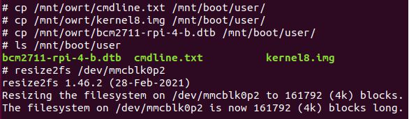
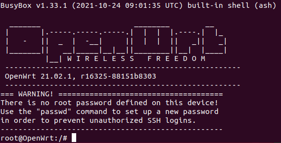
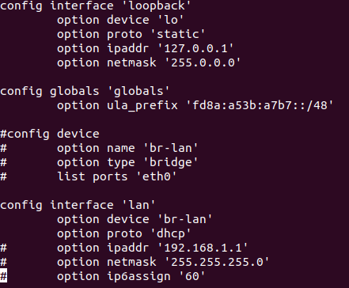
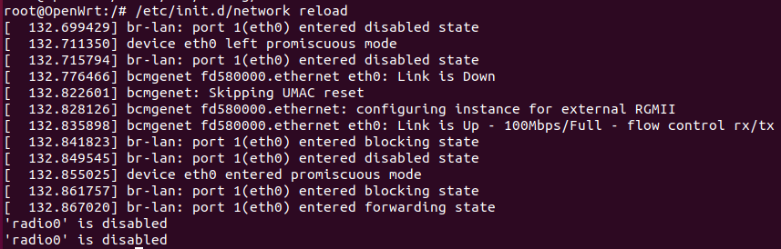
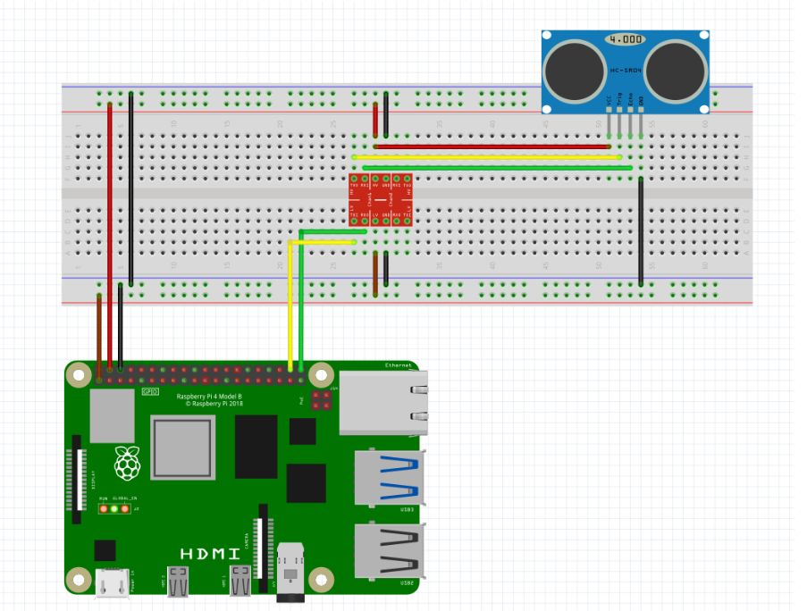

# [SKPS] - Laboratorium 2

## Przygotowanie stanowiska

Po otrzymaniu zestawu początkowego przeszedłem do składania zestawu. Zestaw został złożony i zatwierdzony przez prowadzącego. Wszystkie urządzenia i kable zostały ułożone w sposób ułatwiający pracę na komputerze.

## Pierwsze uruchomienie RPi

Uruchomiłem terminal UART za pomocą programu tio tio /dev/ttyUSB0.
Następnie włączyłem zasilanie i zalogowałem się do urządenia.

## Instalacja OpenWRT z wykorzystaniem systemu ratunkowego

Pobrałem obraz systemu:

`wget https://downloads.openwrt.org/releases/21.02.1/targets/bcm27xx/bcm2711/openwrt-21.02.1-bcm27xx-bcm2711-rpi-4-ext4-factory.img.gz`

Rozpakowałem obraz systemu:

`gzip -d openwrt-21.02.1-bcm27xx-bcm2711-rpi-4-ext4-factory.img.gz`

Zamontowałem obraz systemu:

`losetup -P -f openwrt-21.02.1-bcm27xx-bcm2711-rpi-4-ext4-factory.img`

Przekopiowałem obraz na drugą partycję:

`dd if=/dev/loop0p2 of=/dev/mmcblk0p2 bs=4096`

Stworzyłem katalogi na partycje:

`mkdir /mnt/boot /mnt/owrt`

Zamontowałem partycję pierwszą obrazu OpenWRT

`mount /dev/loop0p1 /mnt/owrt`

Zamontowałem partycję pierwszą karty SD

`mount /dev/mmcblk0p1 /mnt/boot`

Skopiowałem pliki obrazu systemu:

- `cp /mnt/owrt/cmdline.txt /mnt/boot/user/`
- `cp /mnt/owrt/kernel8.img /mnt/boot/user/`
- `cp /mnt/owrt/bcm2711-rpi-4-b.dtb /mnt/boot/user/`

Powiększyłem system plików:

`resize2fs /dev/mmcblk0p2`

Na koniec zrestartowałem system:

`reboot`

Po po uruchomieniu systemu z OpenWRT skonfigurowałem interfejs sieciowy:

`vi /etc/config/network`

I zrestartowałem sieć:

`/etc/init.d/network reload`

## Interfejs http dla OpenWRT.

W przeglądarce na urządzeniu PC wpisałem adres: http://10.42.0.188, podałem login: root i bez hasła udało mi się zalogować. Wszystko było poprawnie skonfigurowane.

## Eksperymenty w OpenWRT

Następnie pobrałem wymagane do pracy pakiety `opkg update`, `opkg install [package]`:

- `nano`
- `python3`
- `python3-pip`
- `gpiod-tools`
- `i2c-tools`
- `spi-tools`

`pip install python-periphery python3-gpiod gpio4`

## Obsługa akcesoriów przez GPIO

## Zadanie 1: GPIO - wyjście dla LED

Napisałem program, który uruchamiał diodę LED 10 razy.

Znajduje się on w pliku: gpio_led_1.py.

## Zadanie 2: GPIO - wyjście dla LED z płynną zmianą jasności

Napisałem kod w pythonie, który płynnie zmieniał jasność niebieskiej diody.
Znajduje się on w pliku: gpio_led_2.py.

## Zadanie 3: GPIO - wyjście PWM, buzzer pasywny

Napisałem kod w pythonie, który generował kolejne dźwięki gamy C-dur w 2 oktawach.
Znajduje się on w pliku: gpio_led_snd.py.

## Zadanie 4: GPIO - wejście

Napisałem kod w pythonie, który włączał diodę, gdy trzymałem przycisk oraz wyłączał ją gdy puszczałem przycisk.

Znajduje się on w pliku: gpio_led_in.py.

## Zadanie 5: Akcesoria do wyboru

Prowadzący dał mi dalmierz.

Przygotowałem schemat dołączenia go do RPi:

Zabrakło mi czasu do napisania programu.
