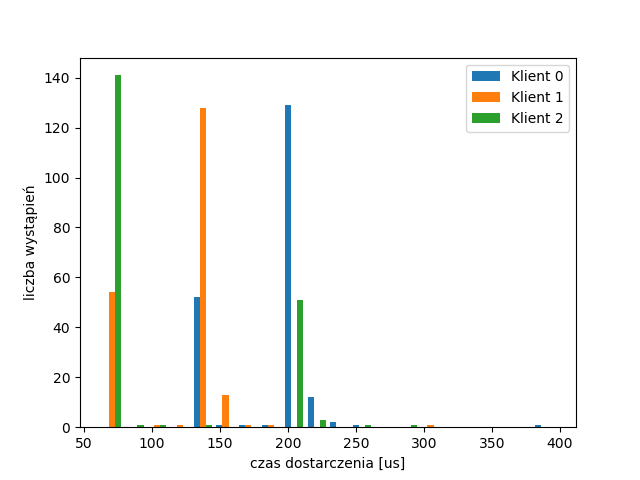
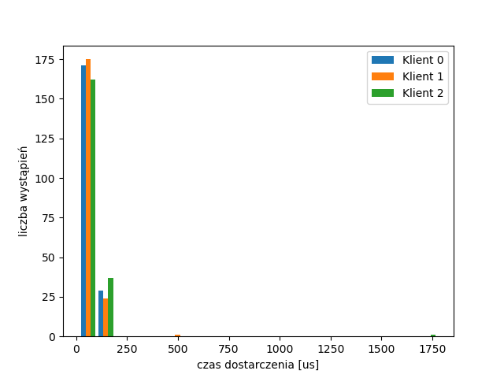
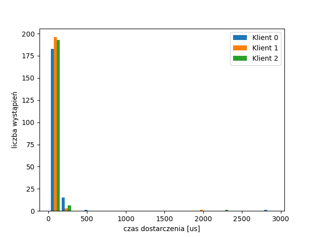
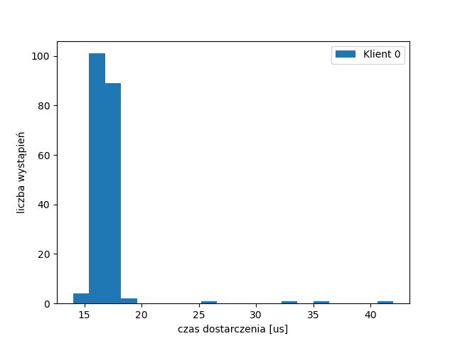
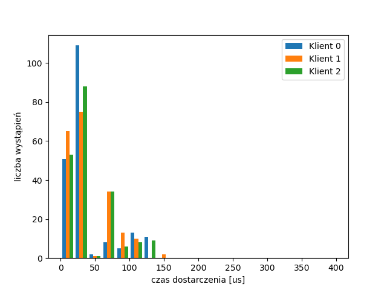
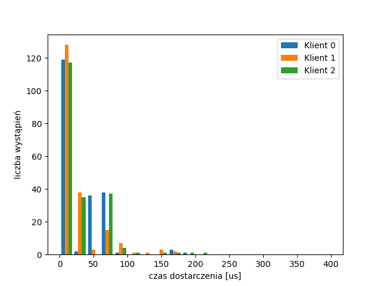
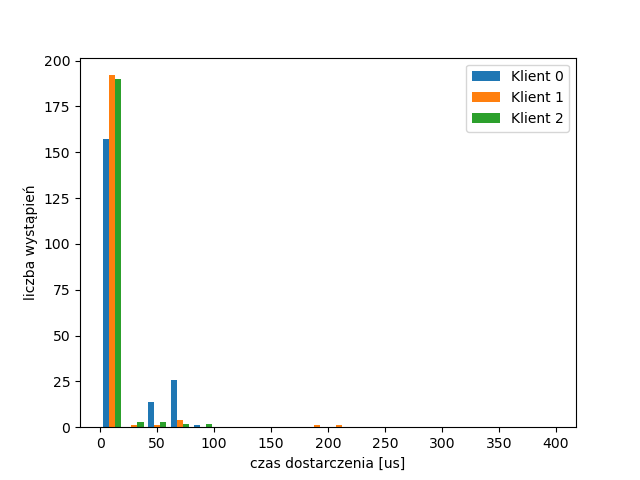
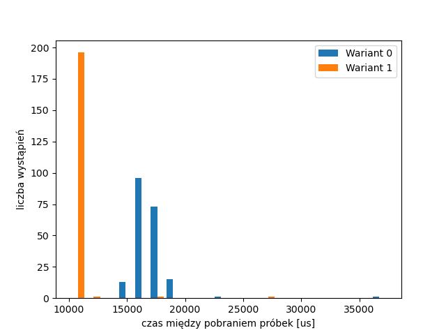

# [SKPS] - Laboratorium 4

Cel laboratorium:
1. [x] Przetestowanie działania programów na “gospodarzu”
2. [x] Zbudowanie pakietu dla OpenWRT
3. [x] Ustalenie granicznej wartości czasu przetwarzania
4. [x] Rozkład czasu dostarczenia danych
5. [x] Aktywne oczekiwanie
6. [x] Właściwy pomiar czasu

Parametry: `cw4a $NUM_CLIENTS 200 10000 $PROCESSING_TIME`


## Ustalenie granicznej wartości czasu przetwarzania

| Wariant | Czas przetwarzania | Obciążenie |
|---------|--------------------|------------|
| 1       | 210 000            |+           |
| 2       | 420 000            |+           |
| 3       | 650 000            |-           |
| 4       | 800 000            |-           |


## Rozkład czasu dostarczenia danych

### Wariant 1

Czas przetwarzania: 105 000.



Przy użyciu funkcji ```htop``` sprawdzono ilość pracujących rdzeni - 1.


### Wariant 2

Czas przetwarzania: 210 000.



Przy użyciu funkcji ```htop``` sprawdzono ilość pracujących rdzeni - 2.

### Wariant 3

Czas przetwarzania: 325 000.




### Wariant 4

Czas przetwarzania: 400 000.




## Aktywne oczekiwanie

Środowisko: 4 rdzenie, 3 klientów, brak obciążenia.

Czas przetwarzania: 300 000

### Wariant 0 - brak aktywnego oczekiwania



### Wariant 1 - aktywne oczekiwanie klienta 0



### Wariant 2 - aktywne oczekiwanie wszystkich kilentów




## Właściwy pomiar czasu

Środowisko: 4 rdzenie, 3 klientów, brak obciążenia.

Czas przetwarzania: 300 000

**Wariant 0**: brak zmian  
**Wariant 1**: branie pod uwagę czasu wysłania przy `usleep`



> Czy rzeczywiście okres między pobraniami zestawów próbek jest właściwy?

Nie

> Wyjaśnić obserwowany efekt

Funkcja usleep:

- nie bierze pod uwagę czasu, w którym jedna iteracja pętli jest wykonywana
- gwarantuje, że proces jest uśpiony określoną ilość μs, ale ilość ta może być większa
